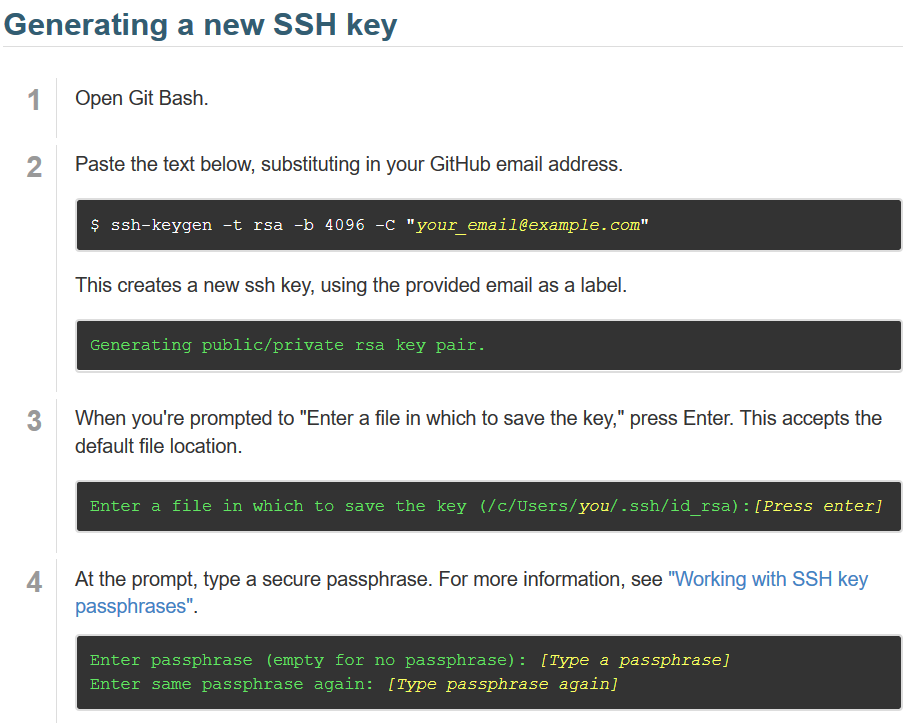
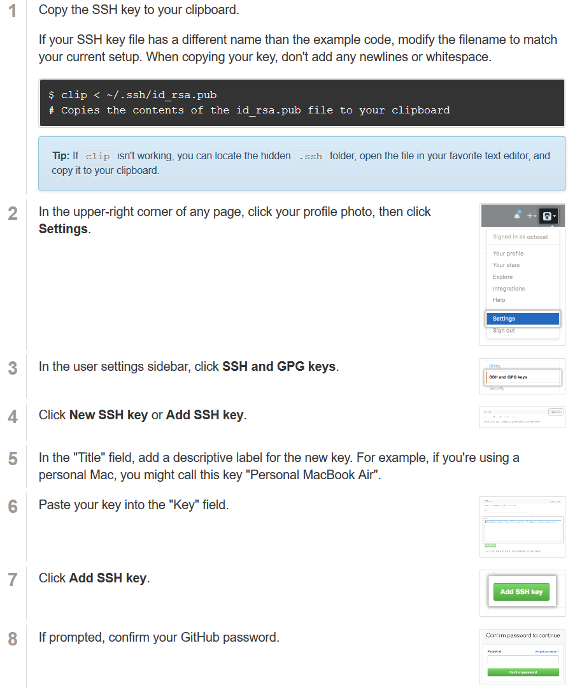

Git
---

Für die Versionskontrolle benutzen wir ein Programm mit dem Namen
**git**. Versionskontrolle bedeutet, dass unterschiedliche Versionen
(1.0, 1.1, 2.0 usw.) organisiert werden und man auch auf einen alten
Stand von dem Projekt zurückwechseln kann, wenn zum Beispiel ein Fehler
auftritt, der vorher nicht da war. Versionskontrolle ist kein neues
Thema, das gibt es schon länger, aber das besondere an git ist, dass du
ohne einen Server zwischen den einzelnen Versionen wechseln kannst.
Außerdem kann es Klartext-Dateien (Dateien die nur Text beinhalten, z.b.
.txt .java .bat) mergen, das bedeutet wenn wir zusammen an einer Datei
(z.b. Java-Klasse) etwas geändert haben, du in Zeile 10 und ich in Zeile
20, fügt es die Änderungen automatisch bei einem \"Update\" zusammen.
Bitte lade dir **git** herunter: <https://git-scm.com/downloads>

Es gibt das git Buch auf Deutsch leider nur in der Version 1 (Englisch
Version 2) aber alles was wir brauchen steht eigentlich da schon drinne:
<https://git-scm.com/book/de/v1>

Du kannst das Programm aber erstmal direkt installieren und einfach die
ganze Zeit auf weiter drücken, die Standarteinstellungen sollten für
dich ausreichen.

Git Befehle:
------------

| Befehl                     | Erklaerung    |
| -------------------------- | ------------- |
| git init                  | Erzeugt ein neues Repository |
| git add Datei/Ordner      | Fügt eine/n Datei/Ordner den "staged changes" hinzu.   Falls die Datei noch nicht in der Versionskontrolle ist, wird diese ebenfalls hinzugefügt.|
| git commit                | Alle staged changes warden in einen Commit gepackt und können nun auf einen Server geladen werden, mit anderen Commits verglichen werden, und und und… |
| git commit -a             | Die Option -a bewirkt, dass auch die "unstaged changes" in den commit hinzugefügt werden. |
| git commit -m "Nachricht" | Fügt dem Commit direkt eine Nachricht hinzu, ohne dass ein weiterer Dialog aufgeht. -a und -m lassen sich selbstverständlich Kombinieren. Die Anführungszeichen nicht vergessen! |
| git fetch                 | Holt die aktuellen Änderungen von einem remote Repository aber überschreibt noch nicht die aktuelle Kopie. So kannst du schnell herausfinden, ob du noch die aktuellste Version hast. |
| git status                | Zeigt dir einen Status über dein aktuelles Repo (hast du Commits die noch nicht gepusht sind oder sind änderungen "gefetcht", welche du noch nicht in deine Kopie hinzugefügt hast).   Kann dir nichts über den Status des remote Repos sagen, wenn du nicht vorher zumindest fetchst! |
| git pull                  | Führ selber git fetch und einen weiteren komplizierteren Befehl aus der bewirkt, dass die runtergeladenen Änderungen in deine aktuelle Kopie geschrieben werden.   Wenn du Änderungen an Dateien hast, welche noch nicht commitet wurden und diese Dateien auch von dem Commit auf dem remote Server verändert wurden, ist dieser Vorgang nicht möglich und du wirst darauf hingewiesen. |
| git push                  | Lädt deine neuen Commits auf den remote Server. Falls der remote Server commits hat, die du noch nicht hast, lehnt dieser deinen push ab. |

Es gibt noch viel mehr Befehle und man kann auch noch viel mehr mit git
machen, aber das sollte erstmal ausreichen um ein paar Klassen zu
bearbeiten und mir über einen remote Server zugänglich zu machen.

Github
------

Wie bereits erwähnt nutzen wir einen remote Server. Github.com ist eine
Webseite, welche einem die Möglichkeit bietet kostenlose öffentliche
Repositories zu erstellen. Öffentlich bedeutet, dass jeder in den
Quelltext reingucken kann, es also für die Entwicklung von Programmen
die man verkaufen möchte nicht geeignet ist, aber das hat uns ja nicht
zu beunruhigen.

Am besten erstellst du dir erstmal einen Account auf der Webseite und
bestätigst deine Email-Adresse. Dann kannst du mir deinen Nutzernamen
schicken, damit ich dir Schreibzugriff zu dem Repository geben kann (wie
bereits erwähnt hat jeder Lesezugriff, da es ja öffentlich ist).

Damit du nicht immer dein Passwort eingeben musst, wenn du eine Änderung
hochladen willst, benutzen wir ein Verfahren namens RSA.

Erstmal musst du dir ein Schlüssel-Paar erzeugen und dieses dann in
deinen Account hochladen. Diese Schlüssel solltest du nicht verlieren
und auf keinen Fall solltest du den öffentlichen Schlüssel (der ohne
.pub am Ende) online stellen, da sich sonst jeder als dich auf Github
ausgeben kann. Hier die Anweisungen direkt von github.com:

Wenn du eine passphrase zu deinem Schlüssel hinzufügen möchtest, wähle
auf keinen Fall das selbe Passwort welches du für deinen Account benutzt
hast. Die passphrase hindert Leute daran deinen privaten Schlüssel ohne
die passphrase zu benutzen, aber falls du dir keine sorgen machst,
deinen Schlüssel ausversehen ins Internet zu stellen, brauchst du
eigentlich keine (einfach Enter).

Jetzt musst du den öffentlichen (NICHT den privaten) Schlüssen deinem
Account hinzufügen:

Register (Nachschlagewerk)
--------------------------

Repository -- Der Ort an dem sich das Projekt befindet.

unstaged changes -- Änderungen welche nicht im nächsten Commit
aufgenommen werden (außer bei git commit -a).

staged changes -- Änderungen welche im nächsten Commit aufgenommen
werden.

remote (repository) -- Das entfernte (engl. remote) Repository auf dem
alle Teammitglieder ihre Änderungen zusammenfügen.

RSA -- Ein asymmetrisches Verschlüsselungsverfahren. Asymmetrisch
bedeutet, dass mit einem öffentlichen Schlüssel verschlüsselt wird und
mit einem privaten Schlüssel entschlüsselt. Wenn jemand deinen privaten
Schlüssel hat, kann er alle Nachrichten, die nur an dich gehen sollten
lesen.
